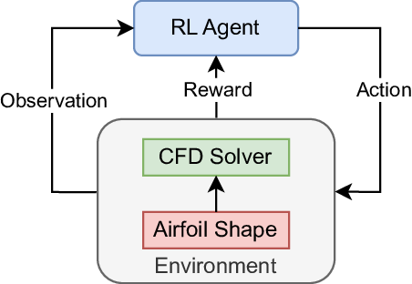
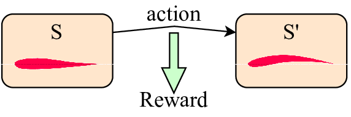
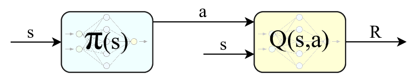

# Airfoil Shape Optimization using Reinforcement Learning

## Motivation
Aircraft design methods used today to determine shape, structure and size begin by taking features from similar aircraft that have been built before. Since this data comes from already built aircraft, it often leads to configurations being stuck in a sub-optimal design space. Since the design space is huge, it is extremely difficult for a human to explore or even guess the initial design. A revolution in aircraft design can therefore perhaps be brought about by machine learning methods which can ‘intelligently’ search through the design space to reach globally optimal configurations. Aircraft design is a tremendously complex process, therefore in this study we begin by exploring methods to design optimal airfoils, which are fundamental shapes that underpin aircraft wing design, imparting them their aerodynamic properties like lift and drag. A measure of an airfoil's quality is its lift-to-drag ratio, which only depends on its shape. In this study, we work towards reaching the optimal shape that achieves the highest lift-to-drag ratio.

## Method
The central part of our method is a reinforcement learning agent whose goal is to achieve an airfoil shape that maximizes the lift-to-drag ratio (its reward function). The RL agent holds a shape, which can be evaluated by a Computational Fluid Dynamics (CFD) solver (its environment) to give back its lift-to-drag ratio. The agent makes sequential changes to the shape (its actions) until an optimal shape is reached. The goal of the agent is to learn a policy that intelligently makes changes to efficiently reach the best design. This is represented in the figure below:

  
   
  <b>Overview of RL as an approach to attack the problem of airfoil design.</b>
   
   

  
   
  <b>One step of an airfoil agent. Actions are taken to change the shape.</b>
   
   

  
   
  <b>Actor-Critic Deep Reinforcement Learning architecture to take actions given states.</b>
   
   

## Contributors
- Parth Prashant Lathi
- Meenal Gupta
- Atharva Aalok

## References
- Viquerat, Jonathan, et al. "Direct shape optimization through deep reinforcement learning." Journal of Computational Physics 428 (2021): 110080.
- Dussauge, Thomas P., et al. "A reinforcement learning approach to airfoil shape optimization." Scientific Reports 13.1 (2023): 9753.